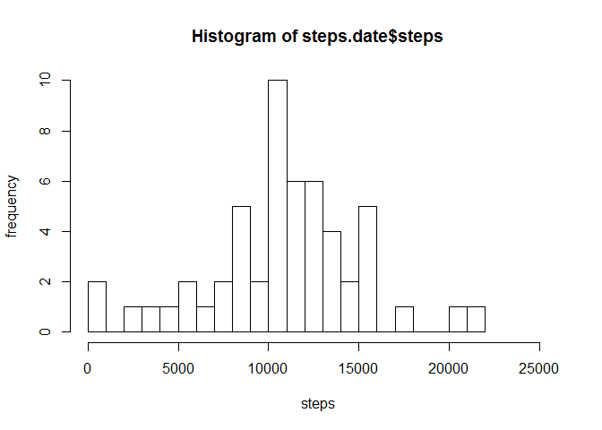
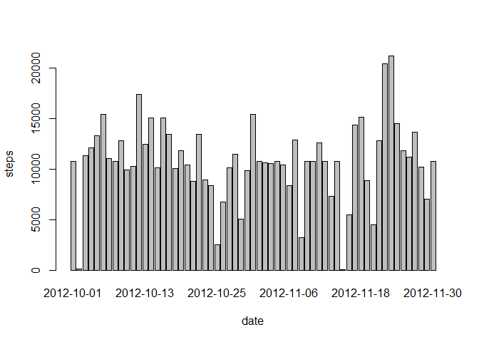
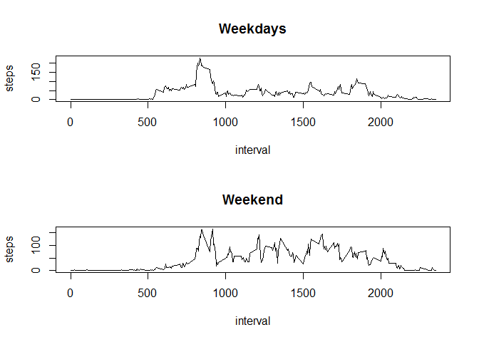

# Reproducible Research - Peer Assesment 1
ABHRA BASAK  
Wednesday, August 12, 2015  

### Download and read the file

```r
filelink <- "https://d396qusza40orc.cloudfront.net/repdata_data_activity.zip"
download.file(filelink, "activity.zip", method = "wget")
unzip("activity.zip")
activity <- read.csv("activity.csv")
```

### What is the mean total number of steps taken per day?

1. **Calculate the total number of steps taken per day**

```r
steps.date <- aggregate(steps ~ date, data = activity, FUN = sum)
```

2. **Make a *histogram* of the total number of steps taken each day**

```r
hist(steps.date$steps, breaks = 25, xlab = "steps", ylab = "frequency", xlim = range(steps.date$steps) * 1.2)
```

 

3. **Calculate and report the *mean* and *median* total number of steps taken per day**

```r
mean(steps.date$steps)
```

```
## [1] 10766.19
```

```r
median(steps.date$steps)
```

```
## [1] 10765
```

### What is the average daily activity pattern?

1. **Make a time series plot** (i.e. `type = "l"`) **of the 5-minute interval (x-axis) and the average number of steps taken, averaged across all days (y-axis)**

```r
steps.interval <- aggregate(steps ~ interval, data = activity, FUN = mean)
plot(steps.interval, type = "l")
```

 

2. **Which 5-minute interval, on average across all the days in the dataset, contains the maximum number of steps?**

```r
steps.interval$interval[which.max(steps.interval$steps)]
```

```
## [1] 835
```

## Imputing missing values

1. **Calculate and report the total number of missing values in the dataset** (i.e. the total number of rows with `NA`s)

```r
sum(is.na(activity))
```

```
## [1] 2304
```

2. **Devise a strategy for filling in all of the missing values in the dataset**

Using the means for the 5-minute intervals as fillers for missing
values.

3. **Create a new dataset that is equal to the original dataset but with the missing data filled in**

```r
activity <- merge(activity, steps.interval, by = "interval", suffixes = c("", ".y"))
nas <- is.na(activity$steps)
activity$steps[nas] <- activity$steps.y[nas]
activity <- activity[, c(1:3)]
```

4. **Make a histogram of the total number of steps taken each day**

```r
steps.date <- aggregate(steps ~ date, data=activity, FUN=sum)
barplot(steps.date$steps, names.arg=steps.date$date, xlab="date", ylab="steps")
```

 

... **Calculate and report the *mean* and *median* total number of steps taken per day**

```r
mean(steps.date$steps)
```

```
## [1] 10766.19
```

```r
median(steps.date$steps)
```

```
## [1] 10766.19
```

... **Do these values differ from the estimates from the first part of the assignment? What is the impact of imputing missing data on the estimates of the total daily number of steps**?
  
The impact of the missing data seems rather low, at least when estimating the total number of steps per day.

## Are there differences in activity patterns between weekdays and weekends?

1. **Create a new factor variable in the dataset with two levels -- "weekday" and "weekend" indicating whether a given date is a weekday or weekend**

```r
isWeekend <- function(date) {
    weekdays(as.Date(date)) %in% c("Saturday", "Sunday")
}
activity$isWeekend <- as.factor(sapply(activity$date, isWeekend))
```

2. **Make a panel plot containing a time series plot** (i.e. `type = "l"`) **of the 5-minute interval (x-axis) and the average number of steps taken, averaged across all weekday days or weekend days (y-axis)**

```r
par(mfrow = c(2, 1))
for (weekend in c(FALSE, TRUE)) {
    steps.type <- aggregate(steps ~ interval, data = activity,
        subset = activity$isWeekend == weekend, FUN = mean)
    plot(steps.type, type = "l", main = ifelse(weekend, "Weekend", "Weekdays"))
}
```

 

